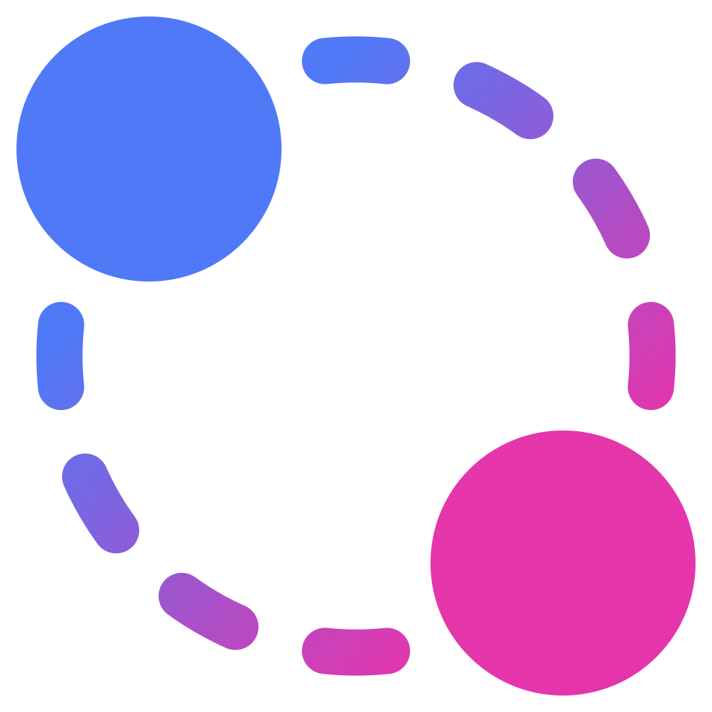
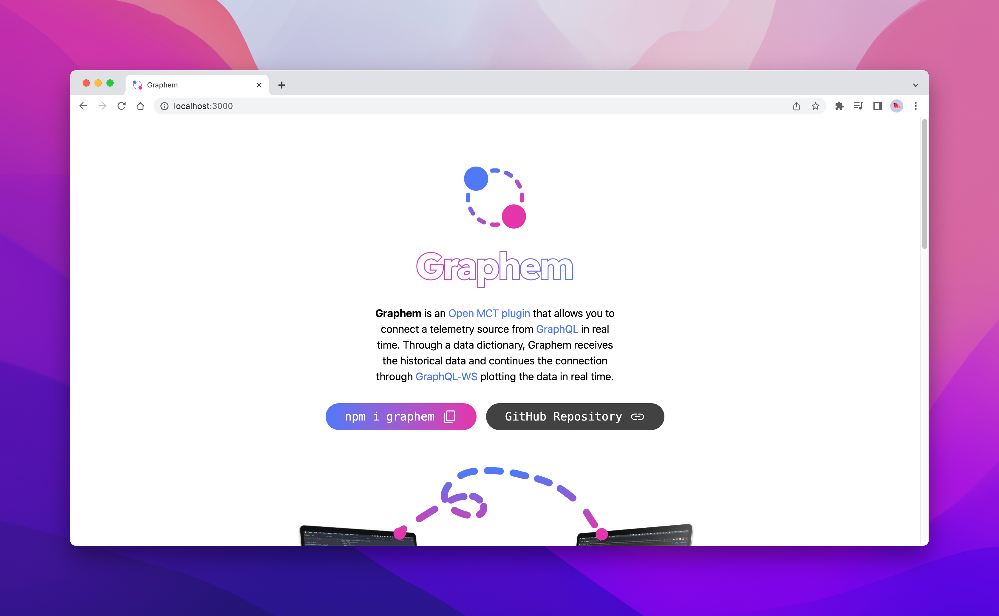

  
  <h1 align="center">Graphem Space</h1>

  🚀 Connector to integrate <a href="https://graphql.org/" target="_blank">GraphQL</a> to <a href="https://nasa.github.io/openmct/" target="_blank">NASA OpenMCT</a> in <a href="https://graphql.org/learn/queries/" target="_blank">queries</a> and <a href="https://www.apollographql.com/docs/react/data/subscriptions/" target="_blank">subscriptions</a>. ⏰

  🚀 <a href="https://www.graphem.space">www.graphem.space</a> 🪐

## 🚀 Concept

Graphem Space is the landing page for the Graphem project. It is a connector to integrate [GraphQL](https://graphql.org/) to [NASA OpenMCT](https://nasa.github.io/openmct/) framework.

- [Graphem Source Code](https://github.com/360macky/graphem)

This website is built with [Astro](https://astro.build/), using [Tailwind CSS](https://tailwindcss.com/) and [React](https://reactjs.org/).
